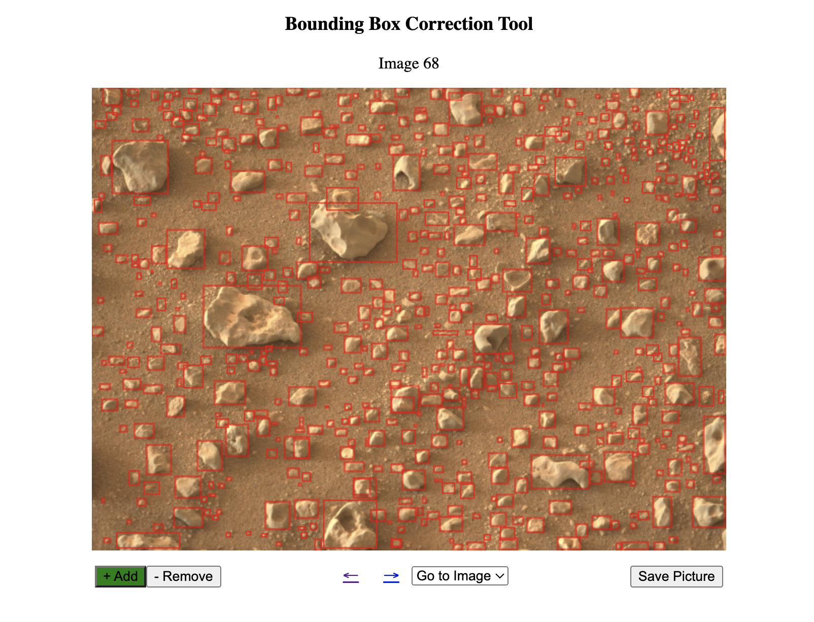

## Bounding Box Correction Tool


A Quick Flask UI To Manually Override Instance Segmentation Bounding Boxes. 
We can then use these boxes to re-prompt the model.

## Setup Instructions

### Installing Required Packages
Make sure to have the necessary packages installed by executing the following commands:

```bash
pip3 install flask
pip3 install json
```

### Project Directory Preparation
First, place your images and labels folder into a folder called "dataset" in the root of the project directory. Ensure that both the images and their corresponding labels share the same filenames. For example:

- dataset
  - images
    - 001.png
    - 002.png
    - ...
  - labels
    - 001.json
    - 002.json
    - ...

### Launching the Application
Navigate into the project directory and start the labelling tool by executing the following commands:

```bash
cd path/to/project/directory
python3 ./labeller.py
```

Now, open [http://127.0.0.1:5000/](http://127.0.0.1:5000/) in your preferred web browser to access the application.

## Usage Guidelines

### Navigation
- Use the arrow icons located beneath the image to move between images, or select a specific image from the dropdown menu.
- Click the "+ Add" button to create new bounding boxes
  - You are now in drawing mode. Drag new boxes on the image canvas as you please.
  - The button will appear green.
  - Either click this button again or click the remove button to exit drawing mode.
- Click the "- Remove" button to remove existing bounding boxes.
  - You are noe in removal mode. Click on a bounding box to remove it.
  - The button will appear green.
  - Either click this button again or click the add button to exit removal mode.
- Click the save button to update the actual JSON file

## Future Goals

### Potential Avenues for Improvement
- Bbox moving
  - Click and drag bboxes to a different location
- Alternative annotation modes
  - Polygon editor
    - Draw vertices of polygons
  - Centroid editor
    - Pinpoint mask centroid coordinates
- Improve basic UI